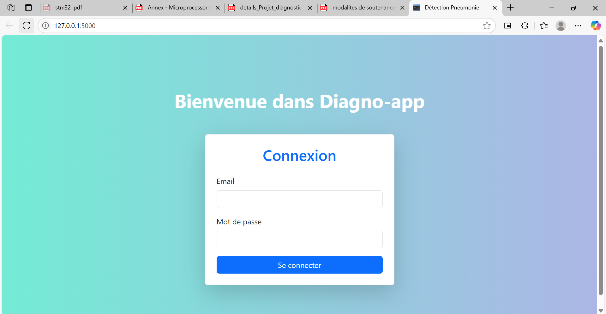
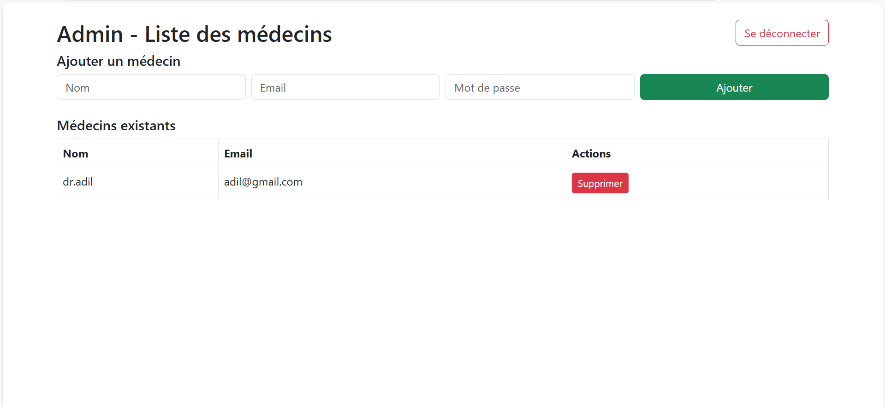
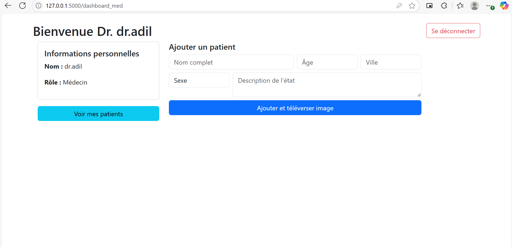

# 🩺 Application de Détection de Pneumonie

Une application web alimentée par l'IA qui détecte la **pneumonie** à partir d'images de radiographie thoracique (rayons X) à l'aide de l'apprentissage profond. Développée avec **Flask**, cette application permet aux utilisateurs de téléverser des images médicales et de recevoir des prédictions instantanées à l'aide d'un réseau de neurones convolutif (CNN) entraîné.

---

## 🚀 Fonctionnalités

- Téléversement d'images de radiographie thoracique (JPG/PNG)
- Prédiction de la présence ou non de **pneumonie**
- Prétraitement intégré des images téléchargées
- Modèle de deep learning pour des prédictions précises
- Interface web simple utilisant HTML/CSS (modèles Jinja2)
- Enregistrement des résultats dans une base de données locale (SQLite)

---

## 📷 Capture d'Écran






```html
📸 Bientôt disponible !
```

---

## 🛠 Installation

Suivez ces étapes pour configurer le projet localement :

```bash
# 1. Cloner le dépôt
git clone https://github.com/ilyas-de1/pneumonia-detection-app.git
cd pneumonia-detection-app

# 2. Créer et activer un environnement virtuel
python -m venv venv
source venv/bin/activate        # Sur Windows : venv\Scripts\activate

# 3. Installer les dépendances
pip install -r requirements.txt

# 4. Initialiser la base de données (si nécessaire)
python init_db.py

# 5. Lancer l'application Flask
python app.py
```

Accédez à l’application via votre navigateur à :  
👉 `http://localhost:5000`

---

## 🧪 Utilisation

- Accédez à l’interface web
- Téléversez une image de radiographie
- Cliquez sur le bouton "Prédire"
- Visualisez le résultat (Pneumonie / Normal)
- (Optionnel) Consultez l’historique des résultats dans la base de données

---

## 🧠 Structure du Projet

```
├── app.py                 # Application Flask principale
├── config.py              # Paramètres de configuration
├── data/                  # Données ou images utilisées
├── static/                # Fichiers statiques (CSS, images téléchargées)
├── templates/             # Modèles HTML pour les pages web
├── model_ai.py            # Chargement du modèle IA et prédiction
├── train_model.py         # Script d'entraînement du modèle CNN
├── data_preprocessing.py  # Prétraitement des images
├── init_db.py             # Script d'initialisation de la base de données
├── extension.py           # Extensions Flask (ex : SQLAlchemy)
├── models.py              # Modèles de la base de données
├── requirements.txt       # Fichier des dépendances Python
└── README.md              # Documentation du projet
```

---

## 🔧 Technologies Utilisées

- **Python**
- **Flask**
- **TensorFlow / Keras**
- **OpenCV / Pillow**
- **HTML/CSS / Jinja2**
- **SQLite + SQLAlchemy**

---

## 📄 Licence

Ce projet est sous licence **MIT**.  
Utilisation, modification et distribution autorisées.

---

## 👤 Auteur

Développé avec ❤️ par [ilyas-de1](https://github.com/ilyas-de1)

Un ⭐️ sur GitHub serait apprécié si ce projet vous a aidé !
